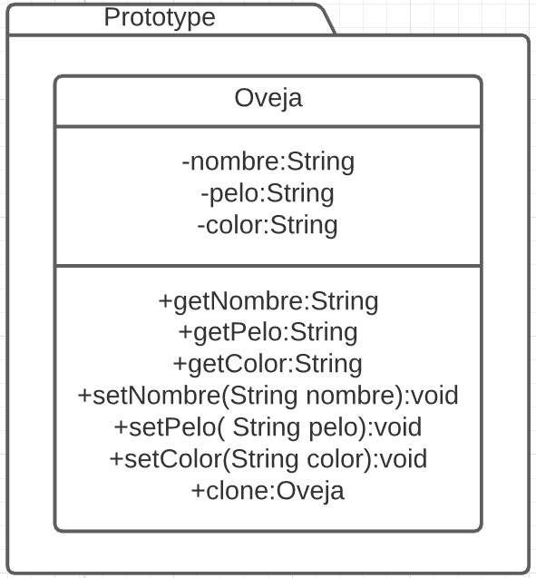

# Prototype
Es un patron creacional. [Link descripcion](https://sourcemaking.com/design_patterns/prototype)

Este patron define un objeto que implementa un método Clone para devolver nuevas instancias con todos los valores de sus atributos o propiedades exactos. No es el mismo objeto simplemente uno nuevo copiado.

## Diagrama de clases

## SOLID
* Single responsibility
No hay razón para que un objeto clonable (que sea usado como prototype) tenga más de una responsabilidad (o razón para cambiar) Este principio es compatible con el patron

* Open/Closed principle
Un objeto prototype puede estar perfectamente cerrado y ser extendido a partir de sus subclases sin problema, este principio se cumple

* Liskov substitution
Cualquier objeto prototype debería comportarse como su padre dada la necesidad, no hay razón para romper este principio. El patron lo cumple

* Interface segregation
Este principio también se cumple dada un buen diseño de modelo. Se cumple

* Dependency inversion
La simpleza de este patron permite una buena implementación de este principio. Se cumple